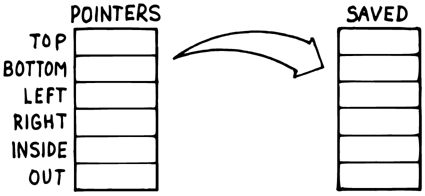
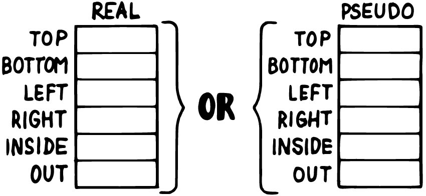

# Chapter 8: Bundling State, Redirecting Behavior

Chapter 7 covered the stack side of Brodie's "Handling Data: Stacks and
States" — when to get off the stack, and how. This chapter covers the
other half: what to do once several related values need to travel
together as one thing, and what to do when a word's *behavior*, not just
its data, needs to change at runtime.

## A Table of Related Values

Some state doesn't come as a single number or flag — it comes as a
handful of related values that only make sense together. A box being
drawn on screen needs a top, a bottom, a left, and a right edge; change
one without the others and the box is nonsense. Brodie's Forth had no
built-in container that could hold a bundle like that under one name,
so his solution was a small defining word (`POSITION`) that carved
individual named cells out of a shared block of raw memory — a
substantial piece of machinery, built solely to give six numbers one
collective identity.

8th's **map** already is that collective identity. A `{ key: value,
... }` literal builds one, and `m:@` / `m:!` read and write it by name:

```8th
{ "top" : 0 , "bottom" : 0 , "left" : 0 , "right" : 0 } var, box

box @ "top" 10 m:! drop
box @ "top" m:@ . cr drop    \ => 10
```

```text
10
```

This is [`code/ch08/box-map.8th`](../code/ch08/box-map.8th), run and
verified. Two things about `m:!` and `m:@` are worth calling out before
they surprise you: `m:!`'s stack effect is `map key value -- map` — it
hands the map back rather than leaving nothing, and `m:@`'s is `map key
-- map value` — it leaves the map sitting underneath the value it
found. Both are the same convention Chapter 6 already showed for
`a:!`: a container word gives you the container back so a chain of
operations can keep going, which means a value fetched or stored in
isolation, as above, leaves that container behind on the stack needing
an explicit `drop` once you're done with it.



Bundling four numbers into one map is only half of Brodie's actual
problem, though. His real motivation was *saving and restoring* a
bundle like this — trying out a change, then either keeping it or
throwing it away. Suppose resizing the box is a two-step affair: begin
a resize, adjust things freely, and only commit the result if it's
wanted.

```8th
box @ G:clone var, draft drop

: begin-resize   \ --
  box @ G:clone draft ! ;

: commit-resize  \ --
  draft @ G:clone box ! ;
```

`G:clone` is the key new word here: given any value, it hands back a
genuinely independent copy — for a container, everything inside is
copied too, not just the outer reference. That distinction matters
immediately. If `begin-resize` had written `box @ draft !` instead,
`draft` and `box` would end up pointing at the *same* map, and editing
one would silently edit the other — exactly the bug Brodie's own
`CMOVE`-based table copy was built to avoid, translated to 8th's own
easy way to get it wrong.

```8th
box @ "top" 10 m:! drop
box @ "bottom" 50 m:! drop

begin-resize
draft @ "top" 999 m:! drop

box @ "top" m:@ . cr drop      \ => 10
draft @ "top" m:@ . cr drop    \ => 999

commit-resize
box @ "top" m:@ . cr drop      \ => 999
```

```text
10
999
999
```

This is [`code/ch08/draft-commit.8th`](../code/ch08/draft-commit.8th),
run and verified. While the draft is being edited, `box` never changes
— the two maps are independent copies from the moment `G:clone` made
them. Only `commit-resize`'s own clone-and-store folds the draft's
values back in. Discarding a draft instead of committing it needs no
special "cancel" word at all: just stop calling `commit-resize`, and
`box` was never touched.

## Two Live States, One Set of Names

A subtler version of the same problem shows up when there isn't a
"real" and a "draft" — there are two states that are both permanently
live, and code needs to read and write "the current one" without
caring which one that is at the moment. Brodie's version alternated
between a `REAL` table and a `PSEUDO` one; a thermostat with separate
comfort and energy-saving setpoints, switchable at will, is the same
shape:

```8th
{ "heat-to" : 68 , "cool-to" : 76 } var, comfort
{ "heat-to" : 62 , "cool-to" : 80 } var, eco

comfort @ var, active-profile

: use-comfort   comfort @ active-profile ! ;
: use-eco       eco @ active-profile ! ;
```



`active-profile` always holds *a* map — just not always the same one.
Reading or writing through it never needs to know or ask which profile
is currently selected; `use-comfort` and `use-eco` are the only two
words in the whole program that do:

```8th
use-eco
active-profile @ "heat-to" m:@ . cr drop     \ => 62

active-profile @ "heat-to" 60 m:! drop

use-comfort
active-profile @ "heat-to" m:@ . cr drop     \ => 68

use-eco
active-profile @ "heat-to" m:@ . cr drop     \ => 60
```

```text
62
68
60
```

This is [`code/ch08/profiles.8th`](../code/ch08/profiles.8th), run and
verified. Nudging the eco profile's setpoint down to 60 has no effect
on comfort's 68 — confirmed by switching to comfort and back — and
switching *back* to eco recovers exactly the nudged value, not the
original 62, because `eco` itself was the thing edited, not a copy of
it. This is a genuinely different move from the draft/commit pattern
above: there, editing happened on a disposable clone, and only a
deliberate `commit-resize` folded it back in. Here, both states are
the real thing, all the time, and switching between them is nothing
more than changing which one `active-profile` currently points at —
the same trick Chapter 1's `apples` used to swap an entire variable's
identity, now applied to a whole bundle of values instead of one.

## Redirecting a Word's Behavior

Brodie's chapter closes with a technique he invented himself and named
`DOER`/`MAKE`: a way to declare a word whose *behavior* — not just its
data — can be swapped out after the fact. The mechanism is genuinely
clever and genuinely awkward to explain: `MAKE somename` doesn't run
code, it *compiles* everything after it, up to the next `;`, as
`somename`'s new definition, and then silently ends whatever word it
appeared inside — meaning a definition that calls `MAKE` twice is
secretly writing the bodies of two *other* words, not two steps of its
own. It works, but it demands holding that compile-time sleight of
hand in mind every time you read it.

8th has a direct equivalent that doesn't ask for that: `defer:` and
`w:is`. Chapter 3 already used `defer:` once, for a forward reference —
naming a word before its behavior exists yet, so a foundational piece
of code can call something a later component fills in. That's one of
`defer:`'s two jobs. The other is exactly Brodie's `DOER`/`MAKE`
motivation: letting a word's actual behavior change at runtime,
deliberately, more than once.

```8th
defer: emit-log   \ s --

: emit-log-console  \ s --
  . cr ;

' emit-log-console w:is emit-log

: log  \ s --
  emit-log ;

"hello" log
```

```text
hello
```

`w:is` takes a word reference — the same tick from Chapter 4's `roman`
— and assigns it as the deferred word's current behavior. Nothing
about `log` mentions `emit-log-console` directly; `log` only ever calls
`emit-log`, so redirecting `emit-log` redirects every word built on top
of `log` too, without touching any of them:

```8th
"" var, captured

: emit-log-capture  \ s --
  captured @ swap s:+ captured ! ;

' emit-log-capture w:is emit-log

"world" log
captured @ . cr    \ => world
```

```text
world
```

This is [`code/ch08/redirect-log.8th`](../code/ch08/redirect-log.8th),
run and verified: `"hello"` prints to the console under the first
assignment, and `"world"` prints nothing at all under the second —
it's been captured into a string instead, exactly as `docs/md`'s own
example for `defer:` describes doing with 8th's built-in output words.

A second genuine use for this same mechanism is factoring a single
differing step out of an otherwise identical loop — Brodie's own
example was two memory-dump words differing only in whether each unit
printed was a byte or a full cell:

```8th
defer: show-item   \ n --

: show-plain    \ n --
  . cr ;

: show-tagged   \ n --
  "item: %d\n" s:strfmt . ;

: dump-list   \ arr --
  ( swap drop show-item ) a:each drop ;

' show-plain w:is show-item
[ 1 , 2 , 3 ] dump-list

' show-tagged w:is show-item
[ 1 , 2 , 3 ] dump-list
```

```text
1
2
3
item: 1
item: 2
item: 3
```

This is [`code/ch08/vectored-loop.8th`](../code/ch08/vectored-loop.8th),
run and verified. `dump-list`'s loop body is written once; `show-item`
is the one differing step, reassigned between calls rather than
duplicated into two nearly-identical versions of `dump-list` itself —
the same factoring instinct Chapter 6 named, aimed here at a step
*inside* a loop rather than a whole word.

One corner of Brodie's `DOER`/`MAKE` material doesn't carry over at
all, and it's worth saying so rather than forcing a translation: he
uses the same mechanism to implement direct recursion, forward-
declaring a word's own name so it can call itself before its
definition is finished. 8th doesn't need that trick, or `defer:`, for
this — a word can call **`recurse`** to invoke itself directly, with no
forward declaration required:

```8th
: fact  \ n -- n!
  dup 1 n:> if
    dup n:1- recurse n:*
  else
    drop 1
  then ;

5 fact . cr    \ => 120
```

```text
120
```

This is [`code/ch08/recurse.8th`](../code/ch08/recurse.8th), run and
verified. Where Brodie needed one general-purpose mechanism to solve
two different problems — changeable behavior *and* self-reference — 8th
simply has two, each aimed at exactly one job.

## Summary

Brodie's "Handling Data" chapter ends with two problems that both come
down to giving something more identity than a single stack value or
variable can hold. A **map** bundles related values under one name,
directly, and `G:clone` gives Chapter 7's save-and-restore instinct a
genuine independent copy to work with instead of a second reference to
the same data. Switching between two permanently live states is just
reassigning which map a variable currently points at — Chapter 1's
`apples` trick, scaled up from one value to a whole bundle. And where
Brodie had to invent `DOER`/`MAKE` to let a word's *behavior* change at
runtime, 8th already has `defer:` and `w:is` — the same forward-
reference tool Chapter 3 used for "not written yet," reused here for
"written, but reassignable," with `recurse` handling the one job
`DOER`/`MAKE` also did that neither of those two is actually for.
